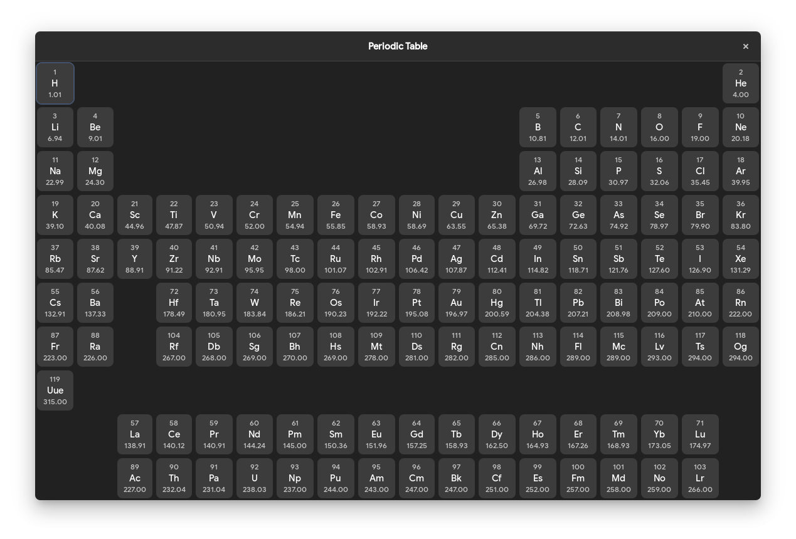

# Periodic Table

Periodic Table is a simple periodic table viewer for GTK written in Rust:sparkles:. 

# Features
  - View the periodic table
  - View details of an element in a seperate window

### Installation

Periodic Table requires [Rust](https://www.rust-lang.org/) to run.

```sh
make
# You probably want to run this as root
make install
```

### Development

Want to contribute? Great!

Periodic Table uses Rust.

Open your favorite Terminal and run this command.

```sh
cargo run # or `cargo watch -x run`, if you have it
```

### Todos

 - Add some color

License
----

GPL-v3
